# Laporan Dokumentasi Teknis
## ELVORA — Platform E-Commerce Premium Activewear Wanita

**Nama Proyek:** Elvora  
**Jenis:** Proyek Tugas Kuliah — Website Development Portfolio  
**NIM:** 24523092  
**Tanggal:** Juni 2026  
**URL Produksi:** https://elvorastudio.vercel.app

---

## Daftar Isi

1. [Deskripsi Proyek](#1-deskripsi-proyek)
2. [Arsitektur Sistem](#2-arsitektur-sistem)
3. [Stack Teknologi](#3-stack-teknologi)
4. [Struktur Halaman](#4-struktur-halaman)
5. [Tampilan Aplikasi](#5-tampilan-aplikasi)
6. [Arsitektur Database](#6-arsitektur-database)
7. [Fitur AI — Style Match](#7-fitur-ai--style-match)
8. [Modul JavaScript](#8-modul-javascript)
9. [API & Serverless Functions](#9-api--serverless-functions)
10. [Keamanan Sistem](#10-keamanan-sistem)
11. [Deployment & Build Pipeline](#11-deployment--build-pipeline)
12. [Kesimpulan](#12-kesimpulan)

---

## 1. Deskripsi Proyek

**Elvora** adalah platform e-commerce activewear premium wanita yang menggabungkan estetika *quiet luxury fashion* dengan budaya wellness modern. Proyek ini dibangun sebagai tugas portofolio kuliah, mendemonstrasikan pengalaman belanja *full-stack* yang menargetkan wanita usia 20–35 tahun yang menghargai keanggunan, kualitas, dan gaya personal dalam activewear mereka.

Kategori produk yang ditampilkan mencakup:
- **Padel** — pakaian untuk olahraga padel
- **Pilates** — set legging dan bra pilates
- **Tennis** — rok dan polo tennis
- **Gym / Training** — sports bra, legging kompresi
- **Running** — pakaian lari teknis
- **Wellness** — pakaian kasual/wellness lifestyle

### Diferensiator Utama

Fitur pembeda adalah **AI Style Match**: pengguna mengunggah foto diri, dan sistem merekomendasikan kombinasi outfit dari katalog Elvora berdasarkan analisis penampilan, proporsi tubuh, dan preferensi gaya — tanpa virtual try-on, tanpa generasi gambar baru. Pengalaman ini terasa seperti konsultan fashion pribadi premium.

### Target Nilai

> Seorang pembeli membuka Elvora, mengunggah foto, dan dalam beberapa detik menerima rekomendasi outfit yang terasa dipilih secara personal untuknya — menariknya secara alami ke katalog premium yang ingin ia jelajahi.

---

## 2. Arsitektur Sistem

```
┌─────────────────────────────────────────────────────────────┐
│                    BROWSER (Client)                         │
│                                                             │
│  HTML Pages (Alpine.js + Vanilla JS ES Modules)            │
│  ├── index.html     (Homepage)                             │
│  ├── shop.html      (Katalog produk)                       │
│  ├── product.html   (Detail produk)                        │
│  ├── cart.html      (Keranjang belanja)                    │
│  ├── checkout.html  (Checkout)                             │
│  ├── auth.html      (Login/Register)                       │
│  ├── account.html   (Dashboard pengguna)                   │
│  ├── style-match.html (Fitur AI)                           │
│  ├── admin.html     (Panel admin)                          │
│  └── ...                                                   │
└───────────┬─────────────────────────┬───────────────────────┘
            │                         │
            ▼                         ▼
┌───────────────────┐    ┌────────────────────────────────────┐
│   VERCEL HOSTING  │    │         SUPABASE BACKEND           │
│                   │    │                                    │
│  Static HTML/CSS/ │    │  ┌──────────┐  ┌───────────────┐  │
│  JS files         │    │  │  Auth    │  │  PostgreSQL   │  │
│                   │    │  │  (JWT)   │  │  (17 tables)  │  │
│  Vercel Functions │    │  └──────────┘  └───────────────┘  │
│  ├── ai-advisor   │    │  ┌──────────┐  ┌───────────────┐  │
│  ├── analyze-img  │    │  │ Storage  │  │ Edge Function │  │
│  └── delete-acct  │    │  │ (S3-like)│  │ style-match   │  │
└───────────────────┘    │  └──────────┘  └───────┬───────┘  │
                         └──────────────────────────┼─────────┘
                                                    │
                                                    ▼
                                       ┌─────────────────────┐
                                       │  GEMINI VISION API  │
                                       │  (Google AI)        │
                                       │  gemini-1.5-flash   │
                                       └─────────────────────┘
```

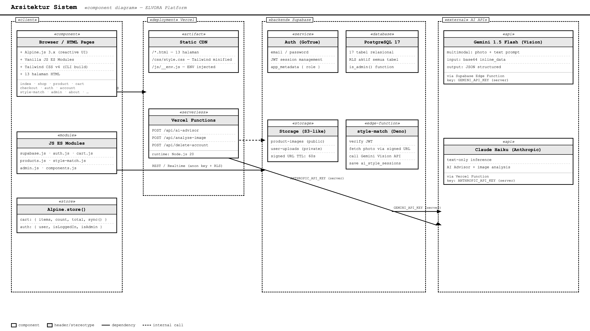

**Pola komunikasi:**
- Browser berkomunikasi langsung ke Supabase menggunakan `anon key` (kunci publik) yang diamankan oleh Row Level Security (RLS).
- Fitur AI Style Match memanggil Supabase Edge Function (bukan API AI langsung dari browser), sehingga `GEMINI_API_KEY` tidak pernah terekspos ke client.
- Vercel Functions digunakan untuk operasi server-side tertentu (proxy AI Advisor, hapus akun).

---

## 3. Stack Teknologi

### Frontend

| Teknologi | Versi | Fungsi |
|-----------|-------|--------|
| **Alpine.js** | 3.x (CDN) | Framework reaktif UI — cart, modal, filter, auth state |
| **Vanilla JS** | ES2022 (native modules) | Logika fetching data, modul utilitas |
| **Tailwind CSS** | v4 (CLI build) | Utility-first styling dengan design tokens kustom |
| **CSS Custom Properties** | Native | Token brand (`--color-cream`, `--font-display`, dll.) |
| **Swiper.js** | 11.x (CDN) | Carousel hero, galeri gambar produk |

### Backend

| Teknologi | Versi | Fungsi |
|-----------|-------|--------|
| **Supabase Auth** | v2 | Email/password signup, login, manajemen sesi JWT |
| **Supabase PostgreSQL** | v16 | Database relasional — 17 tabel, RLS aktif di semua tabel |
| **Supabase Storage** | Built-in | Gambar produk (publik) dan foto user (privat) |
| **Supabase Edge Functions** | Deno | Server-side proxy untuk Gemini Vision API |

### AI

| Teknologi | Fungsi |
|-----------|--------|
| **Gemini 1.5 Flash** | Analisis foto user → rekomendasi outfit dari katalog |
| **Claude Haiku** (AI Advisor) | Asisten fashion berbasis teks via Vercel Function |

### Deployment

| Platform | Tier | Fungsi |
|----------|------|--------|
| **Vercel** | Free | Hosting static + Vercel Functions + build pipeline otomatis |
| **GitHub** | Free | Source control + CI/CD trigger otomatis via push ke main |

### Build Tooling

| Tool | Fungsi |
|------|--------|
| **Tailwind CSS CLI** | Compile CSS dari `src/input.css` → `css/style.css` |
| **npm scripts** | Otomasi build (`npm run build:css`) |

---

## 4. Struktur Halaman

Proyek terdiri dari **13 halaman HTML** dengan total lebih dari 8.000 baris markup:

| Halaman | File | Deskripsi | Baris |
|---------|------|-----------|-------|
| Homepage | `index.html` | Hero editorial, koleksi unggulan, best sellers, testimonial, newsletter | ~409 |
| Katalog Produk | `shop.html` | Daftar produk dengan filter kategori, ukuran, warna, dan pencarian | ~410 |
| Detail Produk | `product.html` | Gambar produk, varian warna/ukuran, ulasan, produk serupa | ~711 |
| Keranjang | `cart.html` | Item cart, quantity, order summary, kode promo | ~160 |
| Checkout | `checkout.html` | Form alamat pengiriman, ringkasan pesanan, konfirmasi | ~581 |
| Login/Register | `auth.html` | Form signup/login, reset password | ~297 |
| Dashboard Akun | `account.html` | Profil user, riwayat pesanan, wishlist, sesi AI | ~457 |
| Admin Panel | `admin.html` | CRUD produk, koleksi, kategori, testimonial | ~452 |
| Style Match (AI) | `style-match.html` | Upload foto, input preferensi, tampilkan rekomendasi outfit | ~1.251 |
| Tentang | `about.html` | Brand story, nilai-nilai Elvora | ~99 |
| Kontak | `contact.html` | Form kontak, informasi kontak | ~141 |
| Lookbook | `lookbook.html` | Editorial photography dan inspirasi gaya | ~88 |
| Setup Profil | `setup-profile.html` | Onboarding preferensi gaya untuk pengguna baru | ~197 |

### Desain Visual

Elvora mengikuti arah desain **quiet luxury** — menghindari pola template generik:
- Palet netral: krem, sage, slate, ivory
- Tipografi editorial dengan hierarki kontras skala
- Whitespace yang luas dan bernapas
- Hover, focus, dan active states yang dirancang dengan intention
- Komposisi grid editorial (bukan layout kartu seragam)

---

## 5. Tampilan Aplikasi

Berikut adalah tampilan halaman-halaman utama Elvora yang diakses dari URL produksi (https://elvorastudio.vercel.app).

---

### 5.1 Homepage

Halaman utama menampilkan hero editorial, koleksi unggulan, best sellers, testimonial pelanggan, dan newsletter signup.

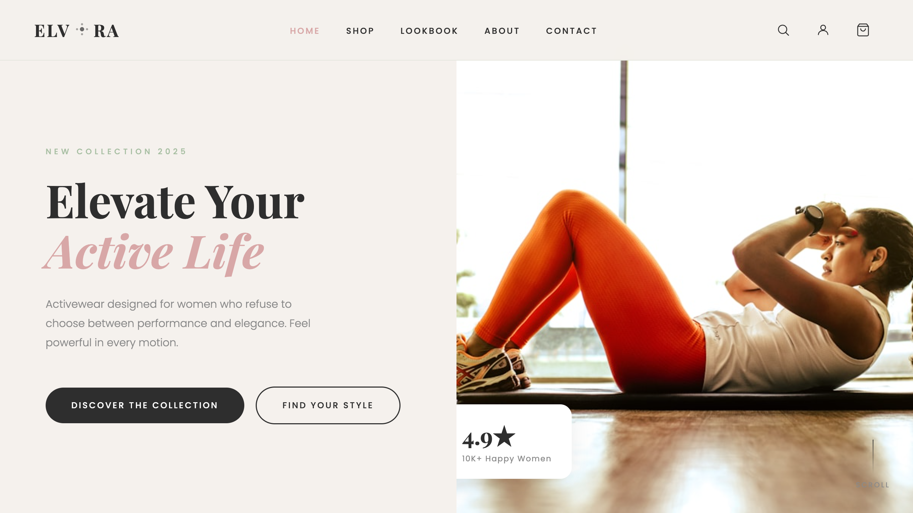

---

### 5.2 Katalog Produk (Shop)

Halaman shop menampilkan semua produk dengan filter kategori aktivitas, ukuran, warna, dan fitur pencarian.

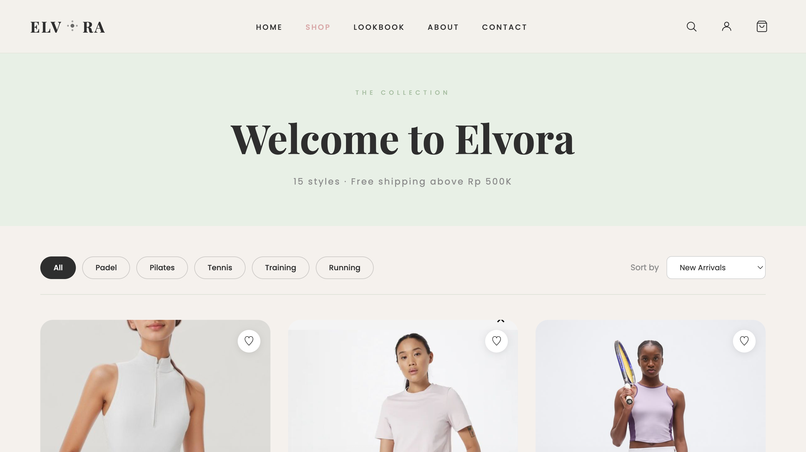

---

### 5.3 Detail Produk

Halaman detail produk menampilkan galeri gambar, pemilihan varian warna dan ukuran, deskripsi produk, ulasan pelanggan, dan produk yang direkomendasikan.

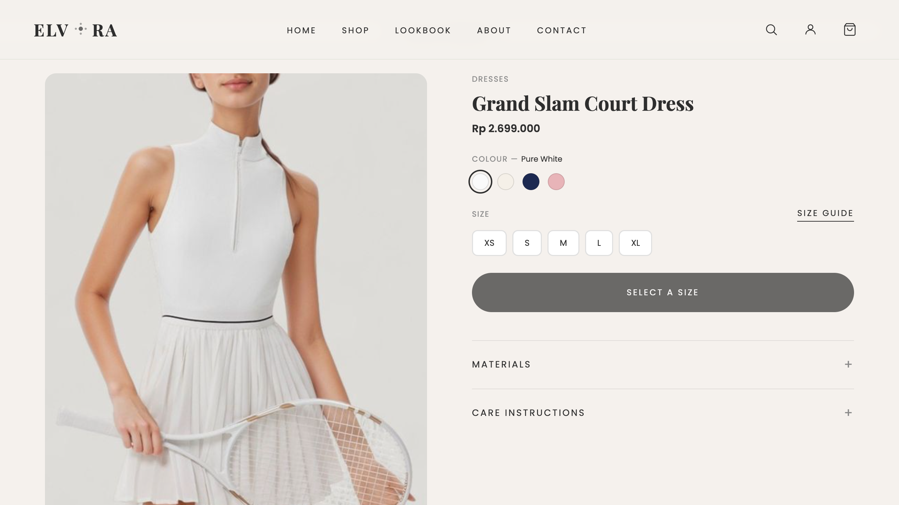

---

### 5.4 AI Style Match

Fitur unggulan Elvora: pengguna mengunggah foto diri dan memilih preferensi gaya untuk mendapatkan rekomendasi outfit personal dari AI.

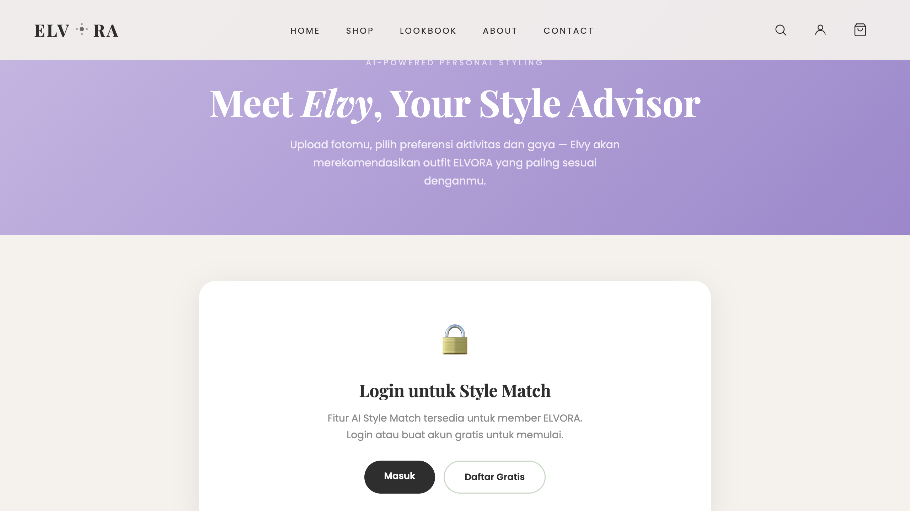

---

### 5.5 Login / Register

Halaman autentikasi dengan form signup dan login, dilengkapi fitur reset password.

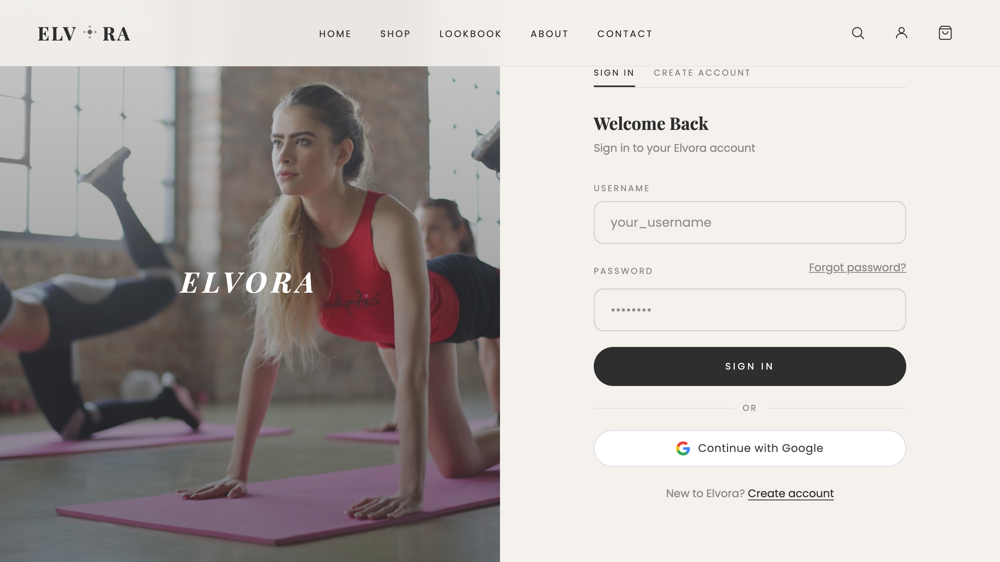

---

### 5.6 Keranjang Belanja

Halaman cart menampilkan item yang ditambahkan, pengaturan quantity, order summary, dan input kode promo.

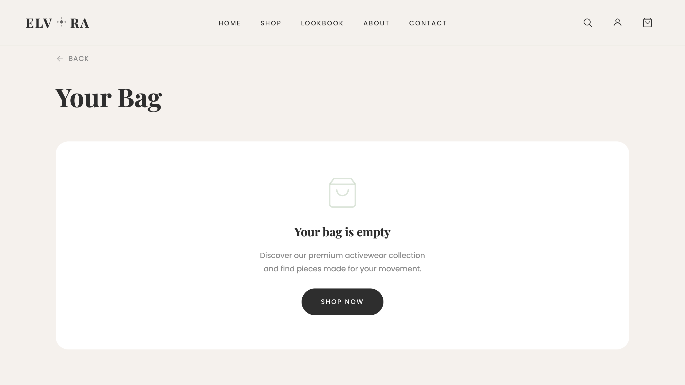

---

### 5.7 Checkout

Halaman checkout dengan form alamat pengiriman, ringkasan pesanan, dan konfirmasi pembelian.

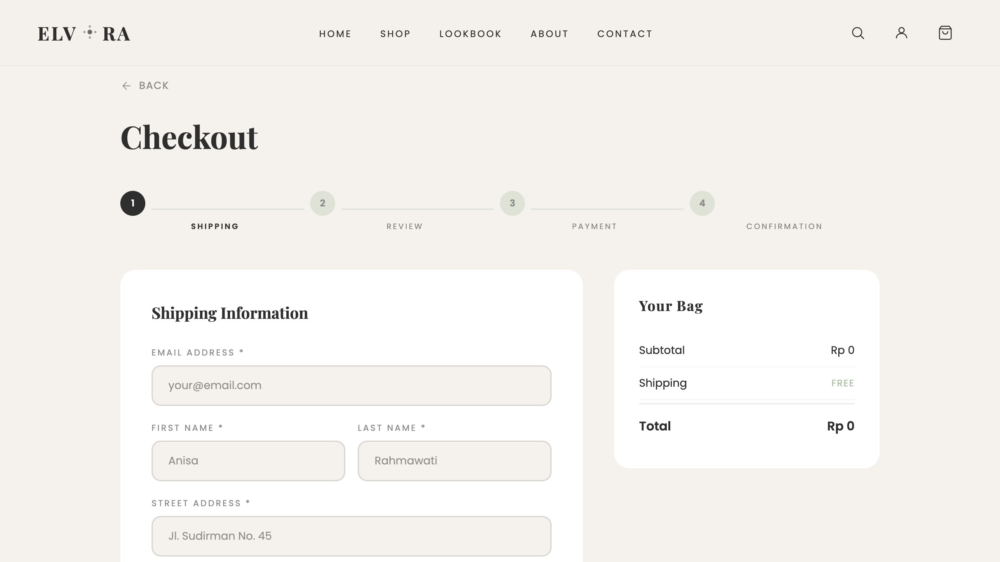

---

### 5.8 Tentang Elvora (About)

Halaman brand story yang menjelaskan nilai-nilai dan visi Elvora.


---

### 5.9 Kontak

Halaman kontak dengan form pengiriman pesan dan informasi kontak.

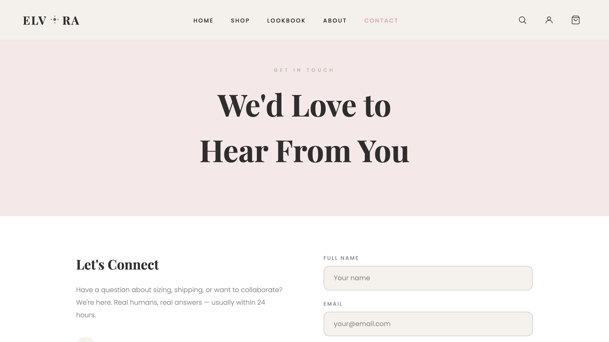

---

### 5.10 Lookbook

Halaman inspirasi editorial photography untuk gaya activewear.


---

## 6. Arsitektur Database

Database dibangun di atas **Supabase PostgreSQL** dengan **17 tabel**, seluruhnya mengaktifkan Row Level Security (RLS).

### Diagram Relasi Tabel

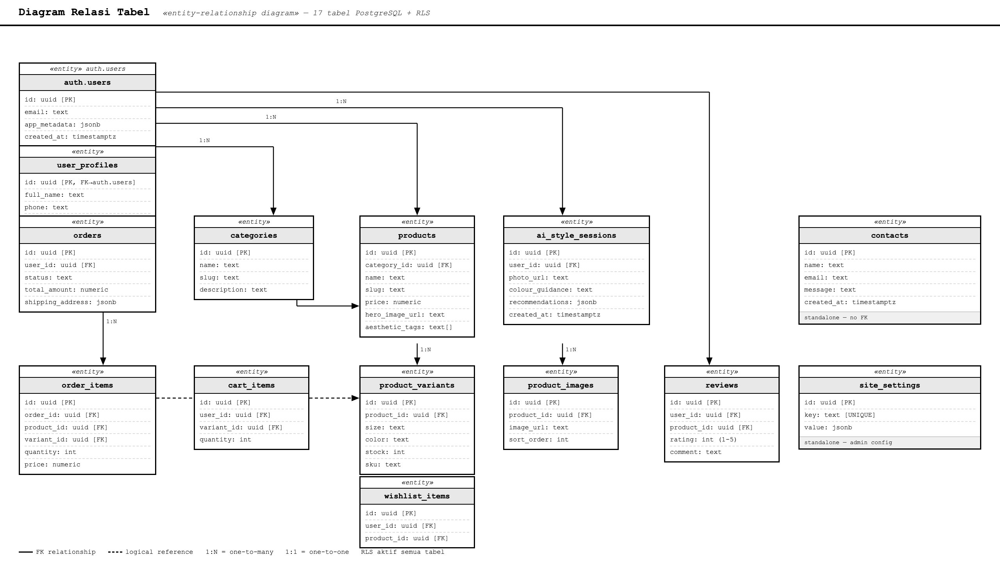

### Ringkasan Tabel

| No | Tabel | Fungsi |
|----|-------|--------|
| 1 | `user_profiles` | Profil pengguna (nama, preferensi gaya) |
| 2 | `categories` | Kategori produk (Padel, Pilates, Tennis, dll.) |
| 3 | `products` | Katalog produk utama |
| 4 | `product_variants` | Varian warna × ukuran per produk, stok per SKU |
| 5 | `product_images` | Gambar produk (multi-gambar per produk) |
| 6 | `collections` | Koleksi kurasi (misal "The Padel Edit") |
| 7 | `collection_products` | Join table produk ↔ koleksi |
| 8 | `cart_items` | Item keranjang belanja per user |
| 9 | `wishlist_items` | Wishlist per user |
| 10 | `orders` | Header pesanan (support guest checkout) |
| 11 | `order_items` | Baris item pesanan (snapshot harga saat checkout) |
| 12 | `reviews` | Ulasan produk (rating 1–5, feedback ukuran) |
| 13 | `testimonials` | Testimoni brand untuk homepage |
| 14 | `newsletter_subscribers` | Email newsletter subscriber |
| 15 | `ai_style_sessions` | Riwayat sesi AI Style Match per user |
| 16 | `promo_codes` | Kode diskon dengan persentase |
| 17 | `contacts` | Submisi form kontak |

### Kebijakan RLS (Row Level Security)

Setiap tabel menerapkan kebijakan akses yang ketat:

- **Tabel publik** (produk, kategori, ulasan): `SELECT` terbuka untuk semua; `INSERT/UPDATE/DELETE` hanya untuk admin.
- **Tabel user-owned** (cart, wishlist, pesanan, profil): operasi CRUD hanya untuk `auth.uid() = user_id`.
- **Fungsi `is_admin()`**: Membaca `auth.jwt() -> 'app_metadata'` — hanya dapat diset oleh `service_role` di server, tidak dapat dipalsukan dari client.
- **Storage bucket `user-uploads`**: Path konvensi `{uid}/{session_id}/filename` — user hanya dapat mengakses file di path prefix mereka sendiri.

### Indeks Database

Dibuat 14+ indeks untuk mengoptimalkan query umum:
- `idx_products_category_id`, `idx_products_is_featured`, `idx_products_is_best_seller`
- `idx_cart_items_user_id`, `idx_wishlist_items_user_id`
- `idx_orders_user_id`, `idx_order_items_order_id`
- `idx_ai_style_sessions_user_id`, `idx_ai_style_sessions_session_token`

### Migrasi Database

Database dikelola melalui **10 file migrasi SQL** berurutan:

| File | Konten |
|------|--------|
| `001_schema.sql` | Schema lengkap — 16 tabel, RLS, storage buckets |
| `002_product_pairings.sql` | Tabel pasangan produk (styling suggestions) |
| `003_phase4_user_profiles.sql` | Perluasan profil user |
| `004_add_username.sql` | Penambahan kolom username |
| `005_style_sessions.sql` | Tabel sesi AI Style Match |
| `006_handle_new_user.sql` | Trigger otomatis buat profil saat signup |
| `007_admin_policies.sql` | Kebijakan RLS untuk panel admin |
| `008_order_items_admin_policy.sql` | Kebijakan admin untuk order items |
| `009_products_admin_update.sql` | Kebijakan admin untuk update produk |
| `010_replace_products.sql` | Penggantian data produk katalog |

Data seeding: `supabase/seed.sql` — menyisipkan 22 produk hero, 220+ varian, 32 ulasan, 5 testimonial.

---

## 7. Fitur AI — Style Match

Fitur AI Style Match adalah diferensiator utama Elvora — pengalaman styling personal bertenaga AI.

### Alur Sistem End-to-End

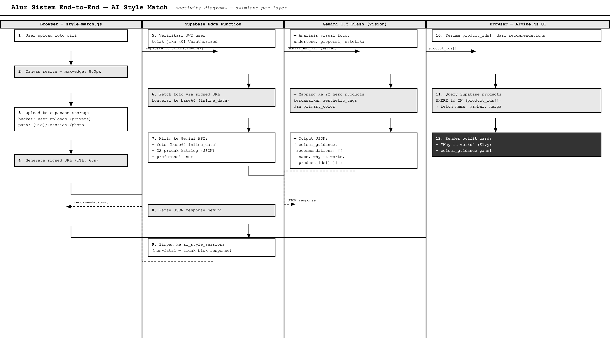

```
Pengguna upload foto
        │
        ▼
[Browser: js/style-match.js]
  1. Canvas resize → maks 800px sisi terpanjang
  2. Upload ke Supabase Storage (bucket: user-uploads)
  3. Generate signed URL (berlaku 60 detik)
        │
        ▼
[Supabase Edge Function: supabase/functions/style-match/index.ts]
  4. Verifikasi JWT pengguna → tolak jika tidak login (HTTP 401)
  5. Fetch foto via signed URL → konversi ke base64
  6. Panggil Gemini 1.5 Flash API dengan:
     - System prompt (persona Elvy, format JSON ketat)
     - Foto sebagai inline image
     - 22 produk hero sebagai konteks katalog JSON
     - Preferensi pengguna (aktivitas, fit, estetika, warna)
  7. Parse respons JSON Gemini
  8. Simpan sesi ke tabel ai_style_sessions (non-fatal)
  9. Kembalikan rekomendasi ke browser
        │
        ▼
[Browser: style-match.html Alpine.js]
  10. Terima product_ids dari rekomendasi
  11. Query Supabase untuk data produk lengkap
  12. Render kartu outfit dengan catatan "Why it works" dari Elvy
```

### Persona AI: "Elvy"

Sistem menggunakan system prompt terstruktur untuk membentuk karakter AI:

- **Peran:** Elvy bertindak sebagai konsultan fashion premium ELVORA
- **Tone:** Sofistikated, personal, referensi langsung ke foto pengguna
- **Format output (JSON ketat):**

```json
{
  "colour_guidance": "rekomendasi palet warna keseluruhan untuk user",
  "recommendations": [
    {
      "name": "Nama outfit",
      "why_it_works": "Penjelasan yang mereferensikan foto dan preferensi",
      "colour_guidance": "Catatan warna spesifik untuk outfit ini",
      "product_ids": ["uuid-1", "uuid-2"]
    }
  ]
}
```

### Strategi Konteks Katalog

- Gemini menerima **22 produk hero** sebagai konteks JSON (id, nama, kategori, deskripsi, warna utama, aesthetic tags)
- Data yang **tidak** dikirim: 220 varian (terlalu banyak token), stok, dan harga (tidak relevan untuk analisis gaya)
- Respons Gemini berisi `product_ids` → browser mengambil data lengkap dari Supabase secara terpisah

### Langkah-langkah Privasi

| Langkah | Detail |
|---------|--------|
| Penyimpanan foto | Bucket Supabase Storage `user-uploads` yang bersifat privat |
| Signed URL | Foto dikirim ke Gemini via URL yang berlaku 60 detik |
| Tidak ada retensi permanen | Foto diperlakukan sebagai ephemeral setelah analisis |
| Tidak ada berbagi pihak ketiga | Foto hanya dikirim ke Gemini API selama satu panggilan API |
| Proteksi API key | `GEMINI_API_KEY` disimpan sebagai secret Edge Function — tidak pernah terekspos ke browser |
| Autentikasi wajib | Style Match memerlukan sesi Supabase yang terautentikasi |
| RLS diterapkan | Tabel `ai_style_sessions` menggunakan RLS — user hanya membaca/menulis sesi mereka sendiri |

---

## 8. Modul JavaScript

Frontend menggunakan arsitektur **ES Modules** — setiap modul bertanggung jawab atas satu domain fungsional:

| File | Tanggung Jawab |
|------|---------------|
| `js/supabase.js` | Inisialisasi client Supabase (singleton), expose ke `window.supabase` untuk Alpine |
| `js/auth.js` | Signup, login, logout, reset password, state autentikasi |
| `js/cart.js` | Alpine store global — add/remove/update item cart, sync localStorage ↔ Supabase |
| `js/products.js` | Fetch produk, filter kategori, load varian dan gambar |
| `js/style-match.js` | Pipeline Style Match — canvas resize, upload Storage, panggil Edge Function, render hasil |
| `js/components.js` | Komponen bersama — navbar, footer, toast notifications |
| `js/admin.js` | CRUD produk, koleksi, kategori (halaman admin) |
| `js/subcategory-styles.js` | Logika styling subkategori (Padel, Pilates, Tennis, dll.) |
| `js/__env.js` | Injeksi environment variable oleh Vercel saat build |

### Alpine.js Store Global

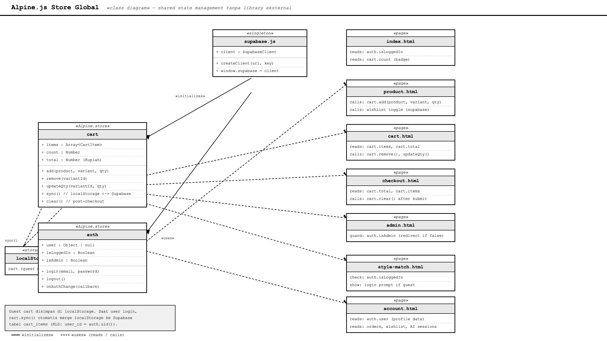

State global cart dan autentikasi dikelola via `Alpine.store()`:

```javascript
Alpine.store('cart', {
  items: [],
  count: 0,
  total: 0,
  add(product, variant, quantity) { ... },
  remove(variantId) { ... },
  sync() { ... } // sync dari/ke Supabase saat login
})
```

Cart mendukung **guest mode** (localStorage) dan otomatis sync ke Supabase saat pengguna login.

---

## 9. API & Serverless Functions

### Vercel Functions

| File | Endpoint | Fungsi |
|------|----------|--------|
| `api/ai-advisor.js` | `POST /api/ai-advisor` | Asisten fashion berbasis teks (Claude Haiku via Anthropic API) |
| `api/analyze-product-image.js` | `POST /api/analyze-product-image` | Analisis gambar produk (Claude Vision) |
| `api/delete-account.js` | `POST /api/delete-account` | Hapus akun pengguna (memerlukan service_role) |

### Supabase Edge Function

| Function | Runtime | Fungsi |
|----------|---------|--------|
| `supabase/functions/style-match/` | Deno | Proxy Gemini Vision API — verifikasi JWT, analisis foto, simpan sesi |

### Konfigurasi Vercel (`vercel.json`)

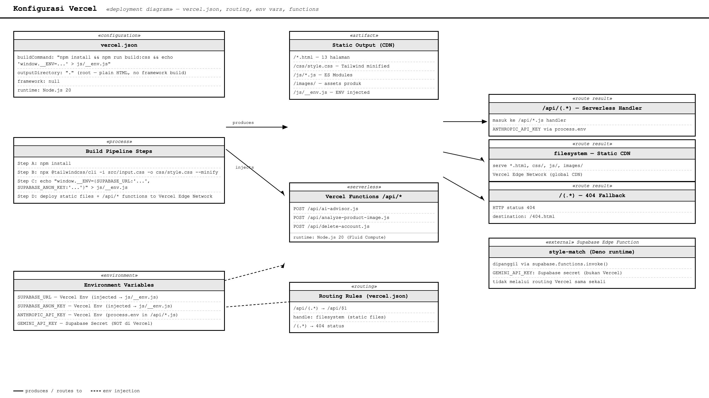

```json
{
  "buildCommand": "npm install && npm run build:css && echo \"window.__ENV = {...}\" > js/__env.js",
  "outputDirectory": ".",
  "framework": null,
  "routes": [
    { "src": "/api/(.*)", "dest": "/api/$1" },
    { "handle": "filesystem" },
    { "src": "/(.*)", "status": 404, "dest": "/404.html" }
  ]
}
```

Build pipeline Vercel secara berurutan:
1. Install dependensi npm
2. Compile Tailwind CSS (minified untuk produksi)
3. Inject environment variables ke `js/__env.js`
4. Deploy static files + serverless functions

---

## 10. Keamanan Sistem

### Prinsip Keamanan Utama

**1. API Key Tidak Pernah di Browser**
- `GEMINI_API_KEY` → Supabase Edge Function secret
- `ANTHROPIC_API_KEY` → Vercel Environment Variable
- `SUPABASE_ANON_KEY` → Kunci publik yang aman (dirancang untuk terekspos), diamankan oleh RLS

**2. Row Level Security (RLS) di Semua Tabel**
- 17 tabel, semuanya mengaktifkan RLS
- Tidak ada tabel yang dapat diakses tanpa kebijakan eksplisit
- Fungsi `is_admin()` membaca `app_metadata` JWT — hanya dapat diset dari server

**3. Path Isolation di Storage**
- User-uploads menggunakan konvensi path `{uid}/{session}/file`
- RLS storage memverifikasi `(storage.foldername(name))[1] = auth.uid()::text`

**4. Snapshot Harga di Order**
- `order_items` menyimpan `unit_price` dan `product_name` saat checkout
- Perubahan harga produk setelah pembelian tidak memengaruhi riwayat pesanan

**5. Admin Authentication**
- Role admin diset via `app_metadata` (hanya bisa diset oleh service_role)
- Tidak dapat di-spoof dari client via user metadata

### Environment Variables

| Variabel | Lokasi | Sumber |
|----------|--------|--------|
| `SUPABASE_URL` | Vercel Env Vars | Supabase Dashboard → Project Settings → API |
| `SUPABASE_ANON_KEY` | Vercel Env Vars | Supabase → anon (public) key |
| `ANTHROPIC_API_KEY` | Vercel Env Vars | Anthropic Console |
| `GEMINI_API_KEY` | Supabase Edge Function Secrets | Google AI Studio |

---

## 11. Deployment & Build Pipeline

### Proses Deployment

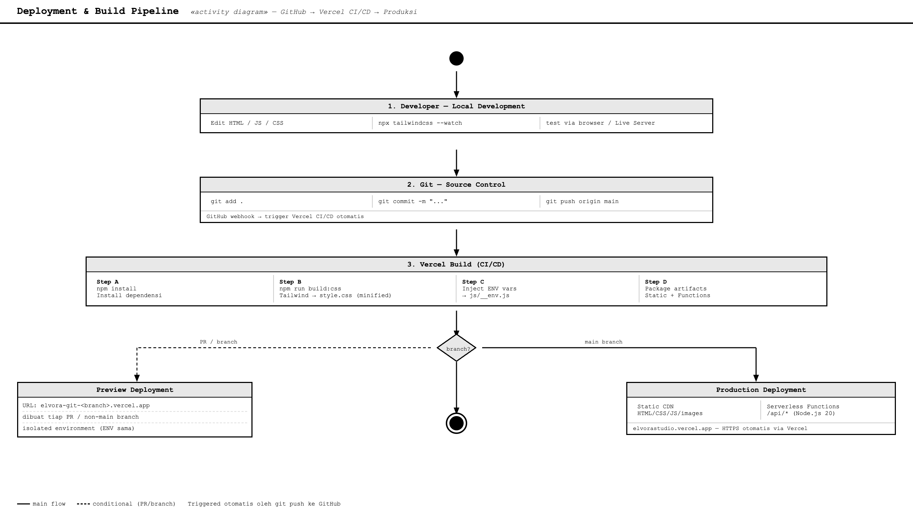

```
Developer push ke GitHub (branch main)
        │
        ▼
Vercel CI/CD trigger otomatis
        │
        ▼
Build Pipeline Vercel:
  1. npm install
  2. npm run build:css
     (npx @tailwindcss/cli -i src/input.css -o css/style.css --minify)
  3. echo "window.__ENV = {...}" > js/__env.js
        │
        ▼
Deploy ke Vercel Edge Network
  ├── Static files (HTML, CSS, JS, images)
  └── Serverless Functions (/api/*)
        │
        ▼
URL Produksi: https://elvorastudio.vercel.app
```

### Lingkungan Pengembangan Lokal

```bash
# Clone repository
git clone <repo-url>
cd elvora

# Salin file env
cp .env.example .env
# isi SUPABASE_URL dan SUPABASE_ANON_KEY

# Watch mode Tailwind CSS
npx @tailwindcss/cli@next -i src/input.css -o css/style.css --watch

# Buka index.html di browser via VS Code Live Server
```

### Database Setup

```bash
# Di Supabase SQL Editor, jalankan berurutan:
supabase/migrations/001_schema.sql    # Schema + RLS + Storage
# ... migrasi 002 s/d 010 ...
supabase/seed.sql                     # Data sampel (22 produk, dll.)
```

---

## 12. Kesimpulan

### Ringkasan Implementasi

| Komponen | Status | Detail |
|----------|--------|--------|
| Homepage editorial | Selesai | Hero, koleksi unggulan, best sellers, testimonial, newsletter |
| Katalog produk | Selesai | Filter aktivitas, pencarian, sorting, 22 produk seeded |
| Detail produk | Selesai | Galeri gambar, varian warna/ukuran, ulasan, produk terkait |
| Keranjang belanja | Selesai | Guest mode + sync Supabase, kode promo |
| Checkout | Selesai | Form alamat, ringkasan pesanan, placeholder payment |
| Autentikasi | Selesai | Signup, login, reset password, sesi JWT |
| Dashboard akun | Selesai | Profil, riwayat pesanan, wishlist, riwayat AI Style Match |
| Panel admin | Selesai | CRUD produk, koleksi, kategori, testimonial |
| AI Style Match | Selesai | Upload foto → analisis Gemini → rekomendasi outfit |
| Database | Selesai | 17 tabel, RLS aktif semua, 10 migrasi |
| Deployment | Selesai | Vercel + GitHub CI/CD |

### Keterbatasan yang Disadari

| Keterbatasan | Detail |
|-------------|--------|
| Tidak ada virtual try-on | Elvora tidak menghasilkan gambar atau mensimulasikan tampilan pakaian di tubuh user |
| Stok tidak real-time | Rekomendasi tidak difilter berdasarkan ketersediaan stok saat ini |
| Pembayaran placeholder | Tidak ada integrasi payment gateway nyata — arsitektur placeholder untuk demonstrasi |
| Kualitas foto mempengaruhi hasil | Foto beresolusi rendah atau pencahayaan buruk dapat mengurangi akurasi rekomendasi |
| Tidak ada refinement iteratif | User tidak dapat memberi feedback untuk memperbaiki hasil rekomendasi dalam satu sesi |

### Pemenuhan Kriteria Penilaian

| Kriteria | Implementasi |
|----------|-------------|
| Deployment berjalan | Vercel — https://elvorastudio.vercel.app |
| Semantic HTML | `<header>`, `<nav>`, `<main>`, `<section>`, `<footer>`, `<article>` digunakan secara tepat di semua halaman |
| Responsive design | Mobile-first, Tailwind breakpoints `sm:`, `md:`, `lg:` di seluruh halaman |
| Fungsionalitas JavaScript | Alpine.js store, ES Modules, fetch Supabase, cart reaktif, auth state |
| Alur pengguna yang jelas | Homepage → Katalog → Detail → Cart → Checkout; juga Signup → Login → Account |
| Kode yang dapat dirawat | Modular — 8 modul JS terpisah, 10 migrasi SQL, konvensi penamaan konsisten |
| Dokumentasi penggunaan AI | `AI-USAGE.md` — penggunaan AI dalam pengembangan dan dalam produk didokumentasikan lengkap |

---

*Laporan ini dibuat sebagai dokumentasi teknis proyek Elvora untuk keperluan pengumpulan tugas kuliah.*
